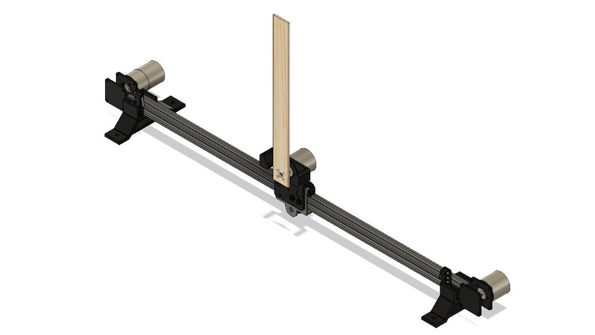

# Inverted Pendulum 

Classic inverted pendulum control system implemented in Python.

## Parts List

- [Encoder](https://www.amazon.com/gp/product/B00UTIFCVA) Qty 2
- [Motor](https://www.amazon.com/uxcell-550RPM-Electric-Reduction-Centric/dp/B01KTZXZDE)
- [Extruder Back Support Plate](https://www.amazon.com/Creality-Original-Extruder-Support-3D/dp/B07KXQPB29)
- [2020 Linear Rail 700mm](https://www.amazon.com/Iverntech-European-Standard-Anodized-Extrusion/dp/B07GRL7FHJ/)
- [GT2 Timing Belt](https://www.amazon.com/Mercurry-Meters-timing-Rostock-GT2-6mm/dp/B071K8HYB4)
- [GT2 Pulley 20 Tooth 6mm Bore](https://www.amazon.com/gp/product/B07CXR7SFL)
- [6mm Flanged Shaft Coupling](https://www.amazon.com/HJ-Garden-Coupling-Hardness-Connection/dp/B07JCQ32T6)
- [M3x20mm Standoff](https://www.amazon.com/HobbyPark-Aluminum-M3x20mm-Standoff-Female-Female/dp/B071X49WPX)
- [Rubber Feet](https://www.amazon.com/gp/product/B073WMSQ21)
- [Limit Switches](https://www.amazon.com/gp/product/B076GM7JQP/)
- Arduino UNO
- [Adafruit Motor Shield for Arduino V2](https://www.adafruit.com/product/1438)
- [Arduino Screw Terminal Shield](https://www.amazon.com/gp/product/B07HF2DD7T)
- [12V DC Power Supply](https://www.amazon.com/gp/product/B073QTNF9F)
- [12V Sealed Lead Acid Battery](https://www.amazon.com/gp/product/B00A82A4N8/)

3D printed parts can be found under the mechanical folder.

- Encoder Bracket.stl: Attaches encoder and motor to the linear rail, Qty 2
- Front Left Bracket.stl: Attaches limit switch to linear rail
- Front Right Bracket.stl: Attaches limit switch to linear rail
- Stand.stl: Support stand, slides on the brackets, Qty 2
- Pendulum Bracket.stl: Attaches pendulum + encoder to the slide

## Wiring Diagram

TODO

The 12V battery helps with motor transients. Without it, the power supply will frequently cut out when the motor changes directions.

## Arduino Programming 

TODO

## Control Program 

TODO
